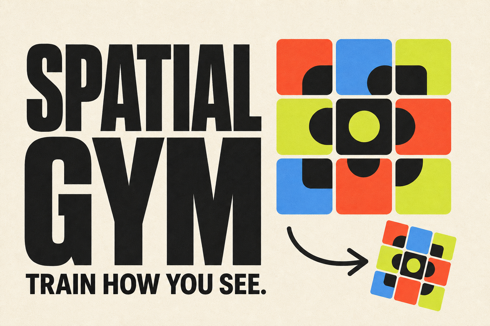

# Spatial Gym

[](https://rfarnham.github.io/nonverbal-reasoning-games/)
[](https://github.com/rfarnham/nonverbal-reasoning-games/actions/workflows/ci.yml)
[](LICENSE)



Short, focused browser games for training nonverbal visual-spatial reasoning.
There is no account, download, backend, or analytics.

**[Play the games](https://rfarnham.github.io/nonverbal-reasoning-games/)**

## Games

| Game | Trains | Status |
| --- | --- | --- |
| [Transformation Match](https://rfarnham.github.io/nonverbal-reasoning-games/games/rotation-match/) | Mental rotation and reflection control | Playable |
| Pattern Matrix | Rule finding and pattern completion | Planned |
| Shape Fold | Spatial folding and working memory | Planned |

## Project shape

This is one statically exported Next.js project. The home page is a catalog;
each game is a self-contained client-side app at `app/games/<game-slug>/`.
Static export gives every game a real, refresh-safe URL on GitHub Pages while
keeping the runtime entirely in the browser.

```text
app/
  games/
    rotation-match/   # one independent mini-game
  page.tsx            # game catalog
lib/
  games.ts            # catalog metadata
docs/
  ADDING_A_GAME.md
  PROJECT_DECISIONS.md
.github/workflows/
  ci.yml
  deploy-pages.yml
```

## Local development

Use Node.js 22 or newer.

```bash
npm install
npm run dev
```

Open `http://localhost:3000`. Useful checks:

```bash
npm run lint
npm run typecheck
npm run build:pages
npm test
```

`npm run check` runs the full local validation sequence.

## Add a game

The short version:

1. Add a self-contained route at `app/games/<slug>/`.
2. Keep its state and interactions in a client component.
3. Add the catalog entry to `lib/games.ts`.
4. Add deterministic logic tests and verify keyboard, touch, and mouse use.

See [Adding a game](docs/ADDING_A_GAME.md) for the full contract.

## Deployment

Every push to `main` is checked, statically exported, and deployed by
`.github/workflows/deploy-pages.yml`. Pull requests run the same quality checks
without publishing. The exported site uses the GitHub Pages project base path,
`/nonverbal-reasoning-games`.

## Product decisions

Initial defaults and the few choices that still need product input are recorded
in [Project decisions](docs/PROJECT_DECISIONS.md). The defaults deliberately keep
the first version private, accessible, and easy to change.

## Contributing

Issues and pull requests are welcome. Read [CONTRIBUTING.md](CONTRIBUTING.md)
before starting a larger game or architectural change.

## License

[MIT](LICENSE)
