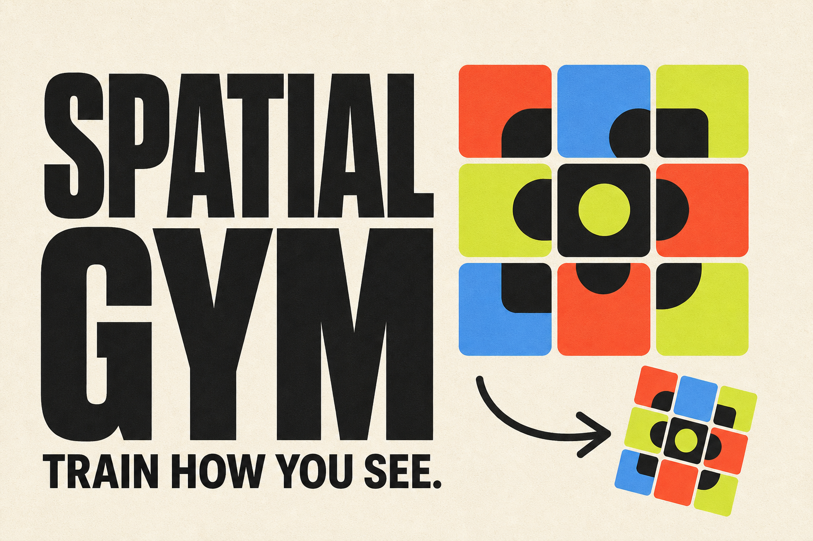

# Spatial Gym

[](https://rfarnham.github.io/nonverbal-reasoning-games/)
[](https://github.com/rfarnham/nonverbal-reasoning-games/actions/workflows/ci.yml)
[](LICENSE)



Short, focused browser games for training nonverbal visual-spatial reasoning.
There is no account, download, backend, or analytics.

**[Play the games](https://rfarnham.github.io/nonverbal-reasoning-games/)**

The prominent **Journey** path connects a stable, snapshotted set of up to
eight canonical games across seven boards: Starter, Junior I–II, Expert I–II,
and Wizard I–II. It includes local player profiles, animal avatars, saved stop
progress, Turbo Time, redemption, level challenges, collectible XP, and two
Math Kangaroo spatial-review stops on every board from Junior I onward. The
game shelf remains available for standalone Campaign and Infinite play; shelf
rounds never alter Journey progress.

## Games

| Game | Trains | Status |
| --- | --- | --- |
| [Transformation Match](https://rfarnham.github.io/nonverbal-reasoning-games/games/rotation-match/) | Mental rotation and reflection control | Playable |
| [Pattern Matrix](https://rfarnham.github.io/nonverbal-reasoning-games/games/pattern-matrix/) | Visual rule finding and pattern completion | Playable |
| [Libra](https://rfarnham.github.io/nonverbal-reasoning-games/games/libra/) | Relational reasoning and visual equivalence | Playable |
| [Braids](https://rfarnham.github.io/nonverbal-reasoning-games/games/braids/) | Spatial perspective and depth tracking | Playable |
| [Whose Left?](https://rfarnham.github.io/nonverbal-reasoning-games/games/whose-left/) | Spatial perspective and direction tracking | Playable |
| [Shape Fold](https://rfarnham.github.io/nonverbal-reasoning-games/games/shape-fold/) | Spatial folding and visual prediction | Playable |
| [Domino Twist](https://rfarnham.github.io/nonverbal-reasoning-games/games/domino-twist/) | Spatial composition and part-whole reasoning | Playable |
| [Changing Strips](https://rfarnham.github.io/nonverbal-reasoning-games/games/changing-strips/) | Visual sequencing and ordered pattern replacement | Playable |
| [Bracelet Search](https://rfarnham.github.io/nonverbal-reasoning-games/games/bracelet-search/) | Sequence search and mental reversal | Playable |
| [Extra Piece](https://rfarnham.github.io/nonverbal-reasoning-games/games/extra-piece/) | Spatial composition, mental rotation, and pattern matching | Playable |

## Labs

Labs are standalone experiments and do not change Journey progress or XP. Math
Kangaroo Shuffle saves its current question, filters, totals, and seen-question
history on the device so a later visit resumes without immediately repeating
questions.

| Lab | Practice | Status |
| --- | --- | --- |
| [Borrow Flash](https://rfarnham.github.io/nonverbal-reasoning-games/lab/subtraction-flash/) | Visual and listening subtraction practice with tap, handwriting, and speech answers | Playable |
| [Math Kangaroo Shuffle](https://rfarnham.github.io/nonverbal-reasoning-games/lab/math-kangaroo/) | Random spatial questions filtered by grade, point value, and question type | Playable |

## Project shape

This is one statically exported Next.js project. The home page is a catalog;
each game is a self-contained client-side app at `app/games/<game-slug>/`.
Static export gives every game a real, refresh-safe URL on GitHub Pages while
keeping the runtime entirely in the browser.

```text
app/
  games/
    bracelet-search/  # route, catalog metadata, and shelf icon
    braids/           # route, catalog metadata, and shelf icon
    changing-strips/  # route, catalog metadata, and shelf icon
    domino-twist/     # route, catalog metadata, and shelf icon
    extra-piece/      # route, catalog metadata, and shelf icon
    libra/            # route, catalog metadata, and shelf icon
    pattern-matrix/   # route, catalog metadata, and shelf icon
    rotation-match/   # route, catalog metadata, and shelf icon
    shape-fold/       # route, catalog metadata, and shelf icon
    whose-left/       # route, catalog metadata, and shelf icon
  journey/            # local profiles, progression boards, reviews, and summaries
  page.tsx            # auto-discovered game catalog
components/
  progression/        # shared Journey bridge and avatar presentation
lib/
  games.ts            # catalog validation and ordering
  progression/        # generic path, attempt, adapter, and storage contracts
scripts/
  generate-game-registry.mjs
tools/
  math_kangaroo_trainer/ # private-data, offline adaptive-core audit tooling
docs/
  ADDING_A_GAME.md
  PROJECT_DECISIONS.md
.github/workflows/
  ci.yml
  deploy-pages.yml
```

## Local development

Use Node.js 22 or newer. The web app setup is unchanged:

```bash
npm install
npm run dev
```

Open `http://localhost:3000`. Useful checks:

```bash
npm run lint
npm run typecheck
npm run build:pages
npm test
```

`npm run check` runs the full local validation sequence.

The full check also runs the adaptive core's invented-data tests. Set up its
Python 3.12 environment once before running `npm test` or `npm run check`:

```bash
python3 -m venv .venv
.venv/bin/python -m pip install -e './tools/math_kangaroo_trainer[test]'
source .venv/bin/activate
```

The adaptive trainer is currently at its required offline Stage 0 corpus-audit
gate. Its canonical question bank and generated review material stay under
ignored `work/`; CI uses only a synthetic corpus. `PASS` requires verified
source-PDF bytes, two content-bound reviews per sampled item, two agreeing
adjudications per exact-duplicate group, at least 98% faithful parsing with all
failures explicit, and a run-bound ontology approved by two reviewers with
gold-set evidence. Stage 1, bulk LLM annotation, and an adaptive player-facing
UI remain blocked until then. See
[the adaptive-core tooling](tools/math_kangaroo_trainer/README.md) and
[ADR 0001](docs/architecture/adr-0001-math-kangaroo-adaptive-core.md).

## Add a game

The short version:

1. Add a self-contained route at `app/games/<slug>/`.
2. Export the game’s shelf metadata and `ShelfIcon` from `catalog.tsx`.
3. Keep its state and interactions in a client component.
4. Add deterministic logic tests and verify keyboard, touch, and mouse use.

The standard development, lint, test, and build commands regenerate the game
registry. A committed route with `page.tsx` and `catalog.tsx` therefore appears
on the home shelf without editing a shared list.

Every released game also exposes a thin `progression-adapter.ts`. It delegates
to that game’s canonical Campaign rounds, Journey-only authored banks,
fingerprint, and Infinite generator; Journey never copies puzzle data or
branches on a game slug. Fixes and balance changes therefore reach standalone
and Journey play through the same engine.

See [Adding a game](docs/ADDING_A_GAME.md) for the full contract.

## Deployment

Every push to `main` is checked, statically exported, and deployed by
`.github/workflows/deploy-pages.yml`. Pull requests run the same quality checks
without publishing. The exported site uses the GitHub Pages project base path,
`/nonverbal-reasoning-games`.

## Product decisions

Initial defaults and the few choices that still need product input are recorded
in [Project decisions](docs/PROJECT_DECISIONS.md). The defaults deliberately keep
the first version private, accessible, and easy to change.

## Contributing

Issues and pull requests are welcome. Read [CONTRIBUTING.md](CONTRIBUTING.md)
before starting a larger game or architectural change.

## License

Source code and original project assets are [MIT licensed](LICENSE), with one
exception. Selected Math Kangaroo question illustrations are included with
authorization and are not granted under the repository’s MIT license. The
Subtraction Flash tracing guides adapt public-domain NIST Hershey font data;
their source and provenance are recorded in
[`public/licenses/Hershey-NIST-Public-Domain.txt`](public/licenses/Hershey-NIST-Public-Domain.txt).
